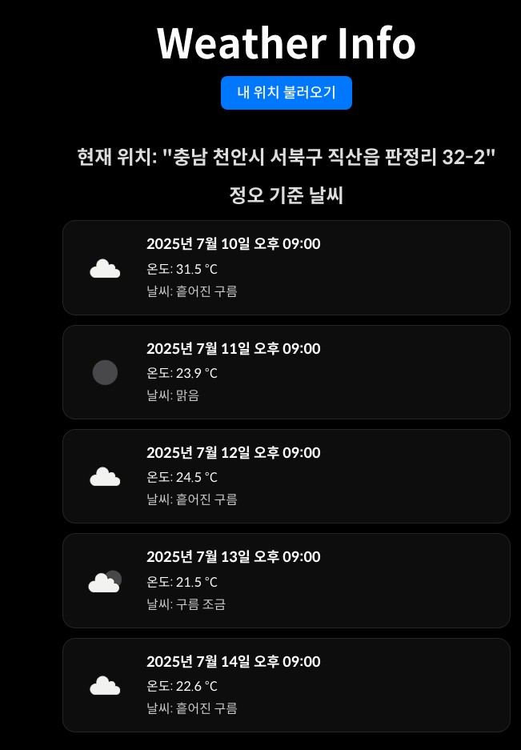

# 🌤️ React Weather App

위치 기반으로 날씨와 현재 주소 정보를 확인할 수 있는 React 기반의 날씨 앱입니다.  
사용자의 현재 위치를 가져오고, Kakao 주소 변환 API를 이용해 **사람이 읽을 수 있는 주소**로 변환한 후, 
해당 위치의 날씨 데이터를 OpenWeather API를 통해 확인할 수 있습니다.

---

## 🚀 데모

👉 [실행 하기](weather-vert-two-35.vercel.app/)

---

## ✅ 주요 기능

| 기능 | 설명 |
|------|------|
| 📍 현재 위치 가져오기 | 브라우저의 geolocation API를 사용하여 위도/경도 수집 |
| 🏠 주소 표시 | Kakao Map API로 좌표를 도로명/지번 주소로 변환 |
| 🌦️ 날씨 정보 표시 | OpenWeather API를 통해 실시간 날씨 데이터를 표시 |
| 🎨 styled-components | 컴포넌트별 스타일을 모듈화하여 관리 |
| ⚠️ 에러 및 로딩 처리 | 위치 허용 거부 또는 API 실패 시 사용자에게 안내 |

---

## 🛠 기술 스택

- **React**
- **styled-components**
- **Kakao Maps API** (좌표 → 주소 변환)
- **OpenWeather API** (날씨 데이터 제공)
- **Geolocation API** (브라우저 위치 권한 요청)

---

## 📁 폴더 구조

```
src/
├── Components/
│   ├── LocationDisplay.jsx     // 주소 출력 컴포넌트
│   ├── WeatherInfo.jsx         // 날씨 출력 컴포넌트
│   └── useWeather.js           // 날씨 관련 커스텀 훅
├── Pages/
│   └── Home.jsx                // 메인 화면 구성
└── App.jsx
```

---

## 🔐 환경 변수 (.env)

아래 환경변수를 `.env` 또는 `.env.local` 파일에 등록해주세요:

```
VITE_KAKAO_API_KEY=카카오_REST_API_KEY
VITE_WEATHER_API_KEY=오픈웨더_API_KEY
```

> `.env` 파일은 반드시 `.gitignore`에 추가해주세요. (API 키 보호용)

---

## 🧪 실행 방법

```bash
git clone https://github.com/KYUNG-BOK/weather.git
cd weather-app
npm install
npm run dev
```

---

## 스크린 샷



---

## ⚠️ 주의 사항

- 모바일 환경에서 위치 권한이 차단되면 기본 위치(천안시 성환읍)를 사용합니다.
- 카카오 API는 **x, y → 주소 변환 전용 REST API**이며, 반드시 **REST API 키**를 사용해야 합니다.
- 무료 OpenWeather 요금제는 하루 1,000회 호출 제한이 있으므로 과도한 호출에 주의해주세요.

---

## 💡 느낀 점

> React 기초를 마무리하며 다양한 API와 사용자 경험 요소를 직접 다뤄볼 수 있었습니다.  
> 특히 `styled-components`와 외부 API 연동을 하나의 흐름으로 연결해보면서 프론트엔드의 실제 서비스를 만들 때 고려해야 할 점들을 많이 배웠습니다.
> 역대급의 난이도였던것 같습니다 ㅠㅠ

---

## 👤 Author

- **복**  
- GitHub: [github.com/KYUNG-BOK](https://github.com/KYUNG-BOK)  
